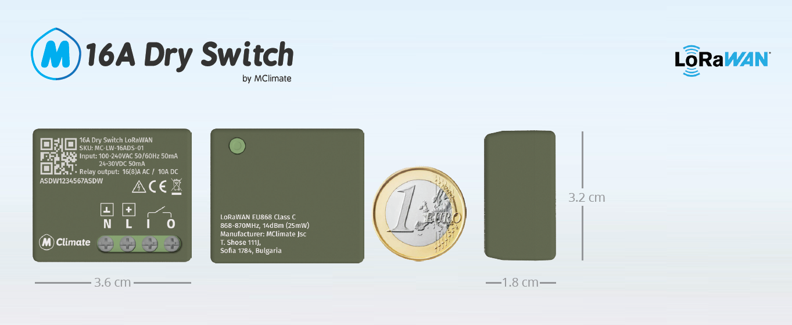

# 🆕 МClimate 16A Dry Switch (16ADS)

<figure><figcaption></figcaption></figure>


Datasheet



User Manual


## General Information

The МClimate 16ADS is a miniature device that features a 16A dry relay. The device is small enough to fit behind most wall switches and outlets. The device operates in LoRaWAN Class C, features FUOTA (Firmware Upgrades Over The Air) and has overheating protection

Learn more about MClimate Smart Building Solutions:



## Power supply

* Mains powered
  * Voltage range - 100-240VAC / 24-30VDC
  * Consumption - 50mA

## Output circuit rating

* Max. switching voltage - 240VAC / 30VDC
* Max. switching current - 16A AC (8A AC for $$cos \varphi = 0.4$$) / 10A DC
* Max. switching power - 3840 (2000W for $$cos \varphi = 0.4$$) / 300W DC

## Safety functions

* Overheating protection

## Supported load types

* Resistive - incandescent bulbs, heating devices
* Capacitive - capacitor banks, electronic equipment, motor start capacitors
* Inductive - LED light drivers, transformers, fans, refrigerators, air-conditioners

## Radio / Wireless

* Wireless technology - LoRaWAN 1.0.3
* Wireless security - LoRaWAN End-to-end encryption (AES-CTR)
* LoRaWAN device type - Class C End-device
* Supported LoRaWAN features - OTAA, ADR, Adaptive Channels setup
* Supported LoRaWAN regions - EU868 - 870; Other LoRaWAN regional settings available upon request&#x20;
* Link budget - 130dB
* RF transmit power - 14dB

## Sensors

### Temperature sensor

* Resolution: 0,1°C
* Accuracy: ±0,2°C (typ) - ±0,7°C (max)

## Wiring diagram


The diagram below should be adhered to strictly, lest you risk damaging the device. The diagram is a representation of the device as seen from the side where the terminals are exposed (their screws).


<figure><figcaption>
16ADS Wiring diagram
</figcaption></figure>

## Placement Guidelines


The device is intended for installation in console boxes, panels and in places that provide an insulating shell of at least 5mm to cover current-carrying parts or other conductive parts!



The device must be mounted to non-conductive surfaces!



The device must be installed in a place that ensures good cooling. Install vertically for improved cooling!



To be used only as a control device and not as a protection device!


If you have any questions, feel free to reach out to us at [lorawan-support@mclimate.eu](mailto:lorawan-support@mclimate.eu)
