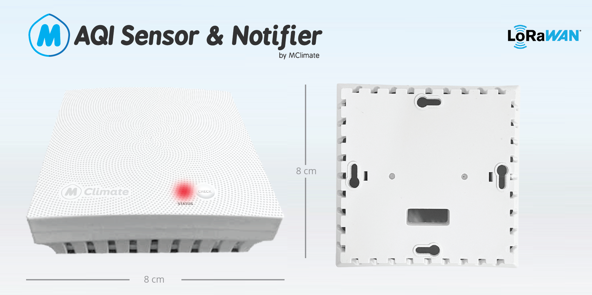

# MClimate AQI Sensor and Notifier LoRaWAN

### General information

MClimate AQI Sensor and Notifier LoRaWAN is an indoor Air Quality Index Sensor and Notifier with 10+ years of battery life, configurable settings and beautiful and discrete design. It is a 4-in-1 sensor with gas, humidity, pressure and temperature measurement based on proven sensing principles by Bosch. It measures AQI, VOC (ppm), temperature, humidity and barometric pressure. It also has a configurable buzzer and RGB LED to notify tenants if the Air Quality Index is below a configurable threshold.

Learn more about MClimate Smart Building Solutions:



### Features

* VOCs
* Temperature
* Humidity
* Barometric pressure
* RGB LED
* Buzzer - 8dB at 10cm

### Power supply

* Battery type: 2xAA
* Operating voltage: 3VDC
* Expected battery life: Up to 10 years (depending on configuration and environment)
* Recommended batteries: Energizer Lithium Ultimate L91
* Device does not operate with rechargeable batteries!

### Compatibility

* LoRaWAN 1.0.3, Class A device, EU868
* Encryption: LoRaWAN End-to-end encryption (AES-CTR)
* Activation: OTAA
* Link budget: 130dB
* RF Transmit Power: 14dB

If you have any questions, feel free to reach out to us at [lorawan-support@mclimate.eu](mailto:lorawan-support@mclimate.eu)
