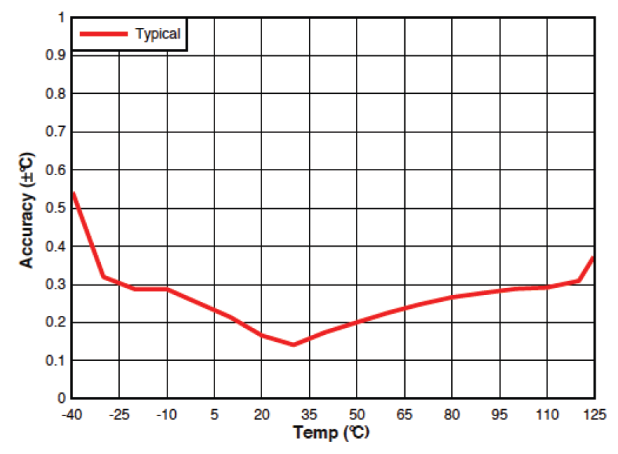
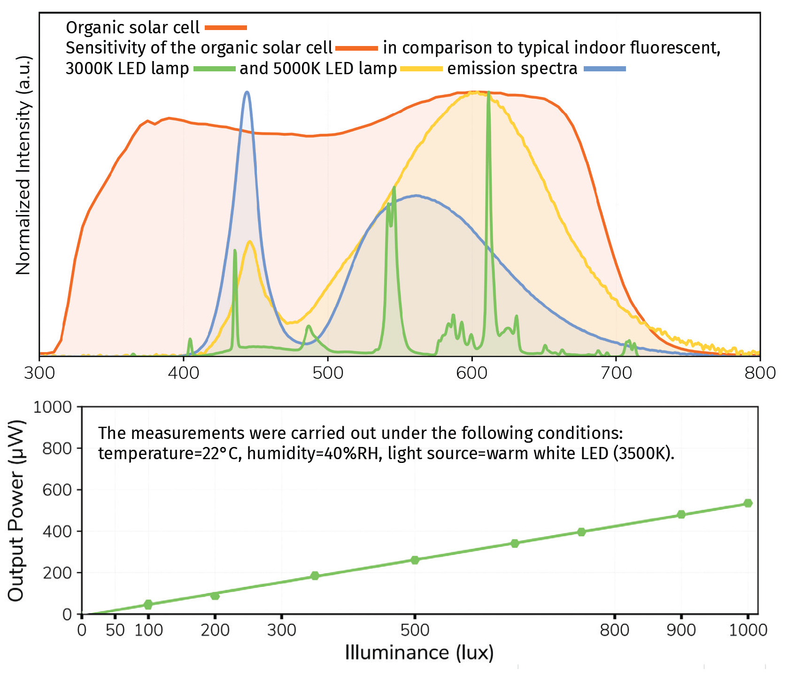
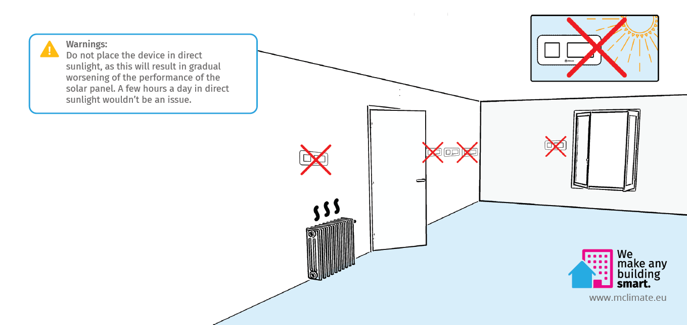

# 🆕 MClimate CO2 Display Lite

<figure><figcaption></figcaption></figure>


Datasheet



User Manual


## General Information

MClimate CO2 Display lite LoRaWAN is a stand-alone CO2 sensor powered entirely by solar energy using an organic solar panel. The device features a 1.54" e-ink screen, temperature and humidity sensor, LUX sensor and NDIR CO2 sensor. The user can see the current levels of CO2 as well as historical trend. The device sends an uplink periodically, or when the "Check" button is pressed. The data from the CO2 Display can be used in any LoRaWAN-compatible system, incl. Building Management Systems to control demand-based ventilation. Sensor information can be exposed as datapoints in Modbus, BACnet and KNX systems through the use of a special gateway.

Learn more about MClimate Smart Building Solutions:



Purchase MClimate CO2 Display lite:



### Features

* Solar-powered and battery free
* CO2 Sensor (NDIR)
* LUX Sensor
* 1.54" e-ink display
* Temperature and Humidity Sensor
* FUOTA
* Child lock

## Power supply

* Solar-powered Lithium-ion capacitor (LIC) and/or USB-C
* **Operating voltage:**
  * 2.5-3.8VDC powered by Solar Panel
  * 5VDC powered from USB-C
* **Expected battery life (depending on configuration and environment):**&#x20;
  * Indefinite powered by solar - up to 14 days in complete darkness

## Compatibility

* LoRaWAN 1.0.3, class A device, EU868
* Encryption: LoRaWAN End-to-end encryption (AES-CTR)
* Activation: OTAA
* Link budget: 130dB
* RF Transmit Power: 14dB

## Sensors

### 1. CO2 sensor

* Resolution: 1ppm
* Accuracy: ±(30ppm +3% of reading)
* Range: 0-5000ppm

### 2. Temperature sensor

* Resolution: 0,1°C
* Accuracy: ±0,2°C (typ) - ±0,7°C (max)

### 3. Humidity sensor

* Resolution: 2%
* Accuracy: ±3% (typ) - ±3% (max)

### 5. LUX sensor

* Resolution: 1 LUX
* Accuracy: ±10%
* Range: 0 - 10 000 LUX

### 6. Organic Solar Cell

<figure><figcaption></figcaption></figure>

## Mounting warning

<figure><figcaption></figcaption></figure>

If you have any questions, feel free to reach out to us at [lorawan-support@mclimate.eu](mailto:lorawan-support@mclimate.eu)
