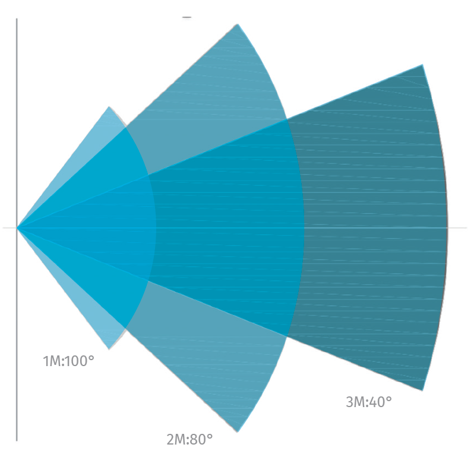

# MClimate CO2 Display

<figure><figcaption></figcaption></figure>


Datasheet



User Manual


## General Information

MClimate CO2 Display LoRaWAN is a stand-alone CO2 sensor powered entirely by solar energy using an organic solar panel. The device features a 2.9" e-ink screen, sensor for movement (PIR), temperature and humidity sensor, LUX sensor and NDIR CO2 sensor. The user can see the current levels of CO2 as well as historical trend. The device sends an uplink when it detects movement as well as periodically. The data from the CO2 Display can be used in any LoRaWAN-compatible system, incl. Building Management Systems to control demand-based ventilation. Sensor information can be exposed as datapoints in Modbus, BACnet and KNX systems through the use of a special gateway.

Learn more about MClimate Smart Building Solutions:



Purchase MClimate CO2 Display:



### Features

* Solar-powered and battery free
* CO2 Sensor (NDIR)
* PIR Sensor
* LUX Sensor
* 2.9" e-ink display
* Temperature and Humidity Sensor
* Anti-theft bracket
* FUOTA
* Child lock

## Power supply

* Solar-powered Lithium-ion capacitor (LIC)&#x20;
  * AND/OR 2 or 4xAA 1.5VDC batteries&#x20;
  * AND/OR USB-C
* **Operating voltage:**
  * 2.5-3.8VDC powered by Solar Panel
  * 2-3.6VDC powered by batteries
  * 5VDC powered from USB-C
* **Expected battery life (depending on configuration and environment):**&#x20;
  * Indefinite powered by solar - up to 21 days in complete darkness
  * 10+ years powered by AA batteries
* _**Device does not operate with rechargeable batteries!**_&#x20;

## Compatibility

* LoRaWAN 1.0.3, class A device, EU868
* Encryption: LoRaWAN End-to-end encryption (AES-CTR)
* Activation: OTAA
* Link budget: 130dB
* RF Transmit Power: 14dB

## Sensors

### 1. CO2 sensor

* Resolution: 1ppm
* Accuracy: ±(30ppm +3% of reading)
* Range: 0-5000ppm

### 2. Temperature sensor

* Resolution: 0,1°C
* Accuracy: ±0,2°C (typ) - ±0,7°C (max)

### 3. Humidity sensor

* Resolution: 2%
* Accuracy: ±3% (typ) - ±3% (max)

### 4. PIR sensor (movement)

* View of angle: X = 100° ; Y = 90°

### 5. LUX sensor

* Resolution: 1 LUX
* Accuracy: ±10%
* Range: 0 - 10 000 LUX

### 6. Organic Solar Cell

<figure><figcaption></figcaption></figure>


The device uses its internal supercapacitor as its main source of power, which is directly charged via the solar cell. When its voltage drops below a certain threshold the device stops operating until it is recharged sufficiently.

In case you are using batteries/USB the following logic applies:

1. Supercapacitor is discharged first (no battery/USB power is utilized).
2. When the supercapacitor voltage drops to the voltage of the batteries/USB it starts charging from the batteries/USB. Thus, the device is effectively powered by the batteries/USB, however it is still through the supercapacitor.
3. If at this point the batteries discharge sufficiently or USB power is no longer supplied the supercapacitor will discharge below the operational threshold and the device will turn off.
4. When and if the supercapacitor recharges sufficiently, it becomes the main power source, and so on...


## Mounting warning

<figure><figcaption></figcaption></figure>

If you have any questions, feel free to reach out to us at [lorawan-support@mclimate.eu](mailto:lorawan-support@mclimate.eu)
