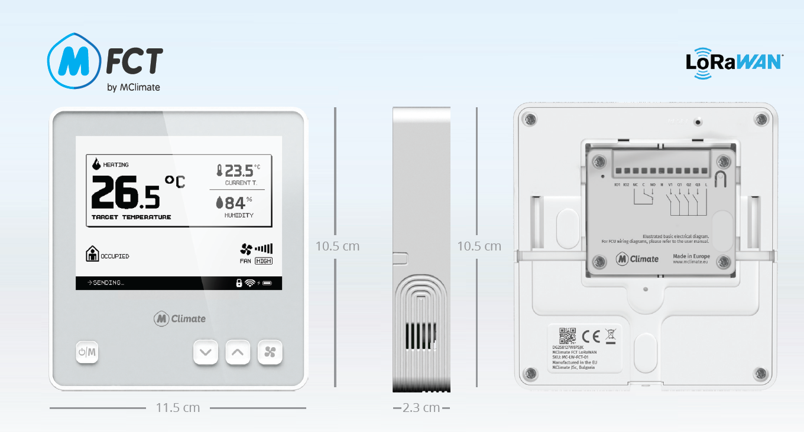

# 😲 MClimate Fan Coil Thermostat (FCT)

<figure><figcaption>
Device view and dimensions
</figcaption></figure>


Datasheet



User Manual


### General information

MClimate Fan Coil Thermostat (FCT) is a thermostat compatible with 2-pipe and 4-pipe Fan Coil Units with 4 SPST relays, 1 DPST dry relay and 0-10V input/output. It features a 4.2" e-ink display, digital temperature and humidity sensor, and 4 buttons. It communicates over LoRaWAN and allows for rapid retrofit of buildings, offering modern BMS capabilities.

Learn more about MClimate Smart Building Solutions:



Purchase MClimate Fan Coil Thermostat:



### Features

* Temperature and humidity sensor
* Compatible with 2-pipe and 4-pipe Fan Coil Units (FCU).
* Manual adjustment of target temperature
* 4.2" e-ink display
* Optional changeover temperature sensor
* 0-10V input/output
* Child lock (ability to lock manual temperature adjustment)

### Power supply

* 100-240VAC 50Hz

### Compatibility

* LoRaWAN 1.0.3, **Class C** device, EU868
* Encryption: LoRaWAN End-to-end encryption (AES-CTR)
* Activation: OTAA
* Link budget: 130dB
* RF Transmit Power: 14dB

&#x20;If you have any questions, feel free to reach out to us at [lorawan-support@mclimate.eu](mailto:lorawan-support@mclimate.eu)
