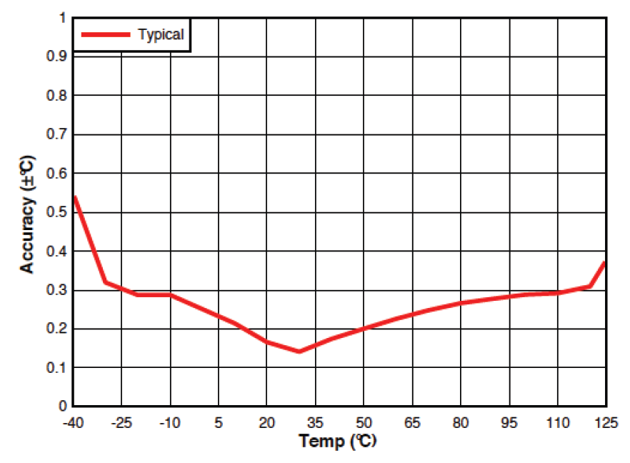
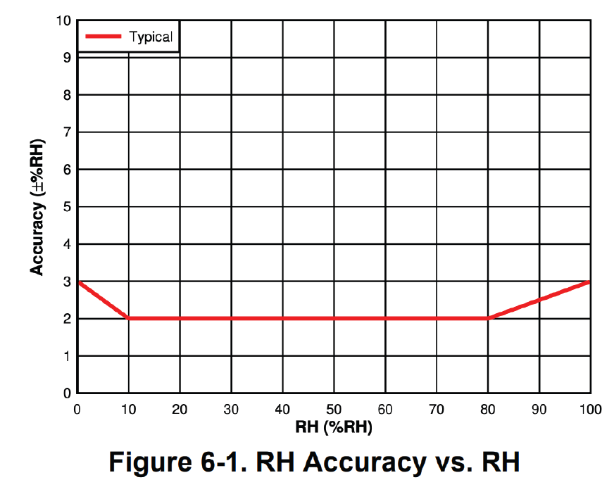
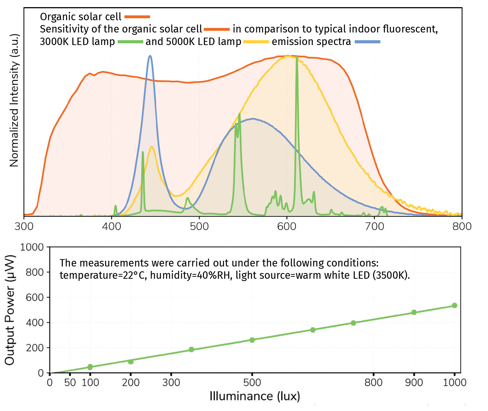
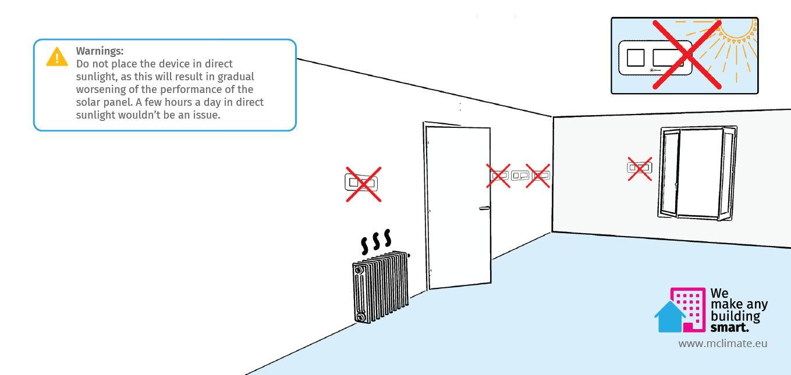

# MClimate HT Display lite

## General Information

MClimate HT Display lite LoRaWAN is a stand-alone HT sensor powered entirely by solar energy using an organic solar panel. The device features a 1.54" e-ink screen, temperature, humidity and LUX sensor. The user can see the current levels of temperature, humidity and light intensity, as well as a historical trend. The device sends an uplink periodically, or when the "Check" button is pressed. The data from the HT Display can be used in any LoRaWAN-compatible system, incl. Building Management Systems to control demand-based ventilation. Sensor information can be exposed as datapoints in Modbus, BACnet and KNX systems through the use of a special gateway.

Learn more about MClimate Smart Building Solutions:



Purchase MClimate HT Display lite:

LINK TO DEVICE PAGE

### Features

* Solar-powered and battery free
* LUX Sensor
* 1.54" e-ink display
* Temperature and Humidity Sensor
* FUOTA
* Child lock

## Power supply

* Solar-powered Lithium-ion capacitor (LIC) and/or USB-C
* **Operating voltage:**
  * 2.5-3.8VDC powered by Solar Panel
  * 5VDC powered from USB-C
* **Expected battery life (depending on configuration and environment):**&#x20;
  * Indefinite powered by solar - up to 14 days in complete darkness

## Compatibility

* LoRaWAN 1.0.3, class A device, EU868
* Encryption: LoRaWAN End-to-end encryption (AES-CTR)
* Activation: OTAA
* Link budget: 130dB
* RF Transmit Power: 14dB

## Sensors

### 1. Temperature sensor

* Resolution: 0,1°C
* Accuracy: ±0,2°C (typ) - ±0,7°C (max)

### 2. Humidity sensor

* Resolution: 2%
* Accuracy: ±3% (typ) - ±3% (max)

### 3. LUX sensor

* Resolution: 1 LUX
* Accuracy: ±10%
* Range: 0 - 10 000 LUX

### 4. Organic Solar Cell

<figure><figcaption></figcaption></figure>

## Mounting warning

<figure><figcaption></figcaption></figure>

If you have any questions, feel free to reach out to us at [lorawan-support@mclimate.eu](mailto:lorawan-support@mclimate.eu)
