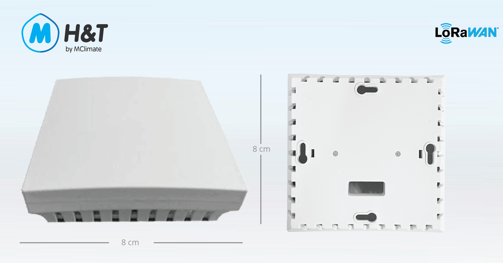

# MClimate HT Sensor LoRaWAN

### General information


Datasheet



User Manual


MClimate HT LoRaWAN Sensor is an indoor temperature and humidity sensor with 10+ years of battery life, configurable settings and beautiful and discreet design.

Learn more about MClimate Smart Building Solutions:



Purchase MClimate AQI Sensor and Notifier LoRaWAN:



## Features 

* Temperature and humidity sensor
* LED for indication
* 2xAA power supply

## Power supply 

* Battery type: 2xAA
* Operating voltage: 3VDC
* Expected battery life: Up to 10 years (depending on configuration and environment)&#x20;
* Recommended batteries: Energizer Lithium Ultimate L91
* Device does not operate with rechargeable batteries!

## Compatibility 

* LoRaWAN 1.0.3, class A device, EU868
* Encryption: LoRaWAN End-to-end encryption (AES-CTR)
* Activation: OTAA
* Link budget: 130dB
* RF Transmit Power: 14dB

If you have any questions, feel free to reach out to us at [lorawan-support@mclimate.eu](mailto:lorawan-support@mclimate.eu)
