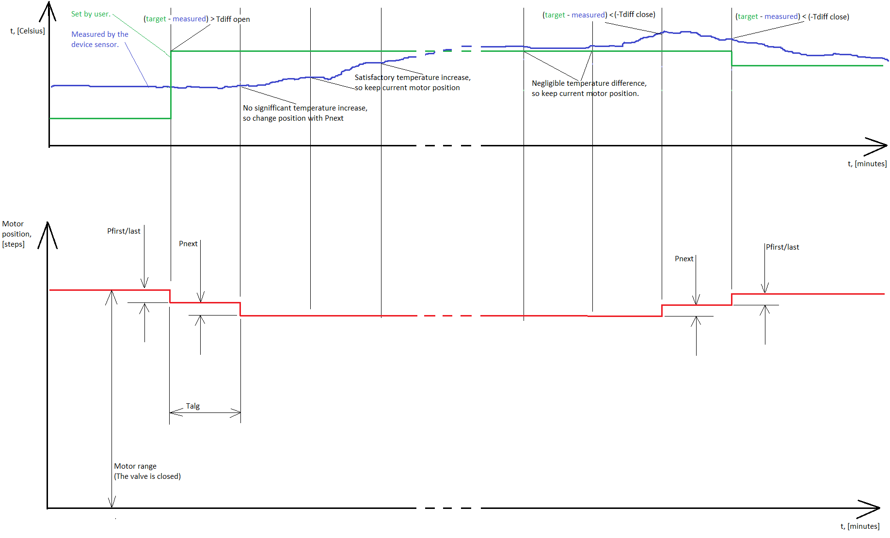

# Algorithm 1 - Equal directional control


This algorithm is NOT available in f.w. >= 4.2



This algorithm is the **only** algorithm available for f.w. < 4.0.


### Internal temperature control algorithm parameters

This command must be used carefully and according to the used online temp. control algorithms. Be sure that the default command parameters aren’t satisfactory before overwriting them. The following parameters are introduced for ease of command explanation:

* Pfirst/last: Indicate the first motor position change in valve opening direction and the last motor position change in valve closing direction;
* Pnext: Indicate the next motor position change in valve opening/closing direction;
* Talg: The period for motor position change decisions depending on the desired and measured temperatures;
* Tdiff open/close: Temperature difference between the target $$T_{target}$$ and measured $$T_{measured}$$ temperatures, to be surpassed, to get decision for valve movement. This parameter is set with separate command for compatibility with older device software versions.

Check Figure 1 for command and entire internal algorithm operation understanding. The example scenario shown on the figure is for heating primary device mode. The algorithm operation is analogical for cooling device primary mode with the only difference that under cooling mode the valve is opened in order to lower the ambient temperature, not to rise it. Check the table below for additional algorithm understanding under different device primary modes.

<table data-header-hidden><thead><tr><th>Device primary mode</th><th width="283.66666666666663">Heating</th><th>Cooling</th></tr></thead><tbody><tr><td><strong>Device primary mode</strong></td><td><strong>Heating</strong></td><td><strong>Cooling</strong></td></tr><tr><td><strong>Valve opened if</strong></td><td> (T_{target}-t_{measured}) > T_{diff  open} </td><td>(T_{target} - T_{measured}) &#x3C; -T_{diff open} </td></tr><tr><td><strong>Valve closed if</strong></td><td>(T_{target}-T_{measured}) &#x3C; -T_{diff close} </td><td>(T_{target} - T_{measured}) > T_{diff closed} </td></tr></tbody></table>

! **Important note on the algorithm operation.**

The implemented temperature control algorithm is compliant with the stepper motor mechanical system. It's mandatory the valve to be opened and later closed with same number of movements per direction. Also, each movement at one of the directions must be with equal number of steps, to the corresponding movement to the other direction. This fashion of motor control is needed, to struggle the loss of generated steps, due to the motor mechanical system backlash. It can be observed at Figure 1.

If Vicki works in mode at which the motor position is set through the server, it is mandatory the server moves the valve with same number of steps, as the internal algorithm (Pfirst/last, Pnext). Also, Pfirst/last/next values less than 16 steps are meaningless.

Figure 1



This command is used to get Vicki internal temperature control alg. parameters from Figure 1, except Tdiff open/close. Server sends the command code and the response is sent from Vicki together with the next keep-alive command. The sent command request and the received command response are described in Table 23. The keep-alive in the response is omitted for clarity.

<table data-header-hidden><thead><tr><th width="131.66666666666666">Byte index</th><th width="150">Sent request</th><th>Received response</th></tr></thead><tbody><tr><td><strong>Byte index</strong></td><td><strong>Sent request</strong></td><td><strong>Received response</strong></td></tr><tr><td>0</td><td>16 – Command code.</td><td>16 – The command code.</td></tr><tr><td>1</td><td></td><td>XX – Internal algorithm temperature check period in minutes – Talg.</td></tr><tr><td>2</td><td></td><td>XX – Internal algorithm first/last opening/closing steps – Pfirst/last.</td></tr><tr><td>3</td><td></td><td>XX – Internal algorithm next opening/closing steps – Pnext.</td></tr></tbody></table>

Table 23

**Example command sent from server:** 0x16;

**Example command response:** 0x16141111 – Talg=20 minutes, Pfirst/last=17 steps,

Pnext=17 steps.




In table 13 is described the command to set the device internal temperature control algorithm parameters, except the Tdiff open/close which is set with separate command.

<table data-header-hidden><thead><tr><th width="135.20724027353867">Byte index</th><th>Hex value - Meaning</th></tr></thead><tbody><tr><td><strong>Byte index</strong></td><td><strong>Hex value - Meaning</strong></td></tr><tr><td>0</td><td>0C – The command code.</td></tr><tr><td>1</td><td>
XX – Internal algorithm temperature check period in minutes – Talg. 

Default value for firmware &#x3C;3.5 is 20min. Default value for firmware >=3.5 is 10 min.
</td></tr><tr><td>2</td><td>XX – Internal algorithm first/last opening/closing steps – Pfirst/last. Default value 20 steps.</td></tr><tr><td>3</td><td>XX – Internal algorithm next opening/closing steps – Pnext. Default value 20 steps.</td></tr></tbody></table>

Table 13

**Example command:** 0x0C131111

With the example command, the internal temperature control algorithm parameters are set as follows: Talg = 19 minutes, Pfirst/last = 17 steps, Pnext = 17steps.


For f.w. version <= 4.0: The minimum applicable value for Pfirst/last and Pnext is 17 steps!

For f.w. version >= 4.1: The minimum applicable value for Pfirst/last and Pnext is 8 steps!

**If you set a lower value, the device will misbehave!**




### Internal temperature control algorithm parameters – Tdiff only



This command is used to get Vicki internal temperature control alg. parameters Tdiff open/close from Figure 1. Server sends the command code and the response is sent from Vicki together with the next keep-alive command. The sent command request and the received command response are described in Table 24. The keep-alive in the response is omitted for clarity.

<table data-header-hidden><thead><tr><th width="132.66666666666666">Byte index</th><th width="145">Sent request</th><th>Received response</th></tr></thead><tbody><tr><td><strong>Byte index</strong></td><td><strong>Sent request</strong></td><td><strong>Received response</strong></td></tr><tr><td>0</td><td>17 – Command code.</td><td>17 – The command code.</td></tr><tr><td>1</td><td></td><td>XX – Tdiff open value, [°C]. The resolution is 1°C.</td></tr><tr><td>2</td><td></td><td>XX – Tdiff close value, [°C]. The resolution is 1°C.</td></tr></tbody></table>

Table 24

**Example command sent from server:** 0x17;

**Example command response:** 0x170201 – Tdiff open=2°C, Tdiff close=1°C.



This command is used to set the Tdiff open/close parameters from Figure 1. In the table below the command data is described.

<table data-header-hidden><thead><tr><th width="132">Byte index</th><th>Hex value - Meaning</th></tr></thead><tbody><tr><td><strong>Byte index</strong></td><td><strong>Hex value - Meaning</strong></td></tr><tr><td>0</td><td>1A – The command code.</td></tr><tr><td>1</td><td>XX – Tdiff open value, [°C]. The resolution is 1°C. Default value is 0x01 (1°C) for firmware &#x3C;3.5. Default value is 0x00 (0°C) for firmware >= 3.5. </td></tr><tr><td>2</td><td>XX – Tdiff close value, [°C]. The resolution is 1°C. Default value is 0x01 (1°C) for firmware &#x3C;3.5. Default value is 0x00 (0°C) for firmware >= 3.5. </td></tr></tbody></table>

**Example command:** 0x1A0201

With the example command, Tdiff open is set to 2°C and Tdiff close is set to 1°C.&#x20;



