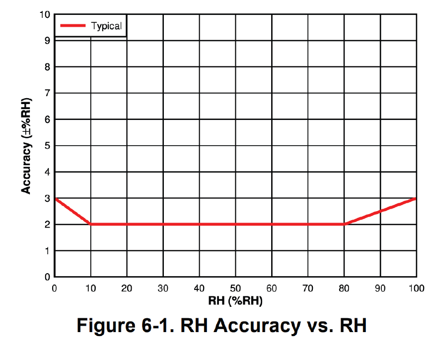

# 🆕 MClimate Wireless Thermostat

<figure><figcaption></figcaption></figure>


Datasheet



User manual


### General information 

MClimate Wireless Thermostat is a stand-alone thermostat powered entirely by solar energy using an organic solar panel.&#x20;

The device features a 2.9" e-ink screen, sensor for movement (PIR), temperature and humidity sensor, LUX sensor and 3 buttons. The user can change the target temperature and see current indoor conditions.&#x20;

The device sends an uplink after any event as well as periodically. The data from the Wireless Thermostat can be used in any LoRaWAN-compatible system, incl. Building Management Systems to control different appliances in the building.

Learn more about MClimate Smart Building Solutions:


[Broken link](broken-reference)


## Features 

* Solar-powered
* PIR sensor
* LUX sensor
* E-ink display
* Temperature & humitity sensor
* 3 buttons
* Anti-theft bracket
* FUOTA
* Child lock
*   Sensing only mode

    (no target temp displayed)

## Power supply 

* Solar-powered Lithium-ion capacitor (LIC)&#x20;
  * AND/OR 2 or 4xAA 1.5VDC batteries&#x20;
  * AND/OR USB-C
* **Operating voltage:**
  * 2.5-3.8VDC powered by Solar Panel
  * 2-3.6VDC powered by batteries
  * 5VDC powered from USB-C
* **Expected battery life (depending on configuration and environment):**&#x20;
  * Indefinite powered by solar - up to 21 days in complete darkness
  * 10+ years powered by AA batteries
* _**Device does not operate with rechargeable batteries!**_&#x20;

## Compatibility

* LoRaWAN 1.0.3, class A device, EU868
* Encryption: LoRaWAN End-to-end encryption (AES-CTR)
* Activation: OTAA
* Link budget: 130dB
* RF Transmit Power: 14dB

## Resources


MClimate Wireless Thermostat - Datasheet


## Sensors

### 1. Temperature sensor

* Resolution: 0,1°C
* Accuracy: ±0,2°C (typ) - ±0,7°C (max)

### 2. Humidity sensor

* Resolution: 2%
* Accuracy: ±3% (typ) - ±3% (max)

### 3. PIR sensor (movement)

* View of angle: X = 100° ; Y = 90°

### 4. LUX sensor

* Resolution: 1 LUX
* Accuracy: ±10%
* Range: 0 - 10 000 LUX

### 5. Organic Solar Cell

<figure><figcaption></figcaption></figure>

## Mounting warning

<figure><figcaption></figcaption></figure>

If you have any questions, feel free to reach out to us at [lorawan-support@mclimate.eu](mailto:lorawan-support@mclimate.eu)
