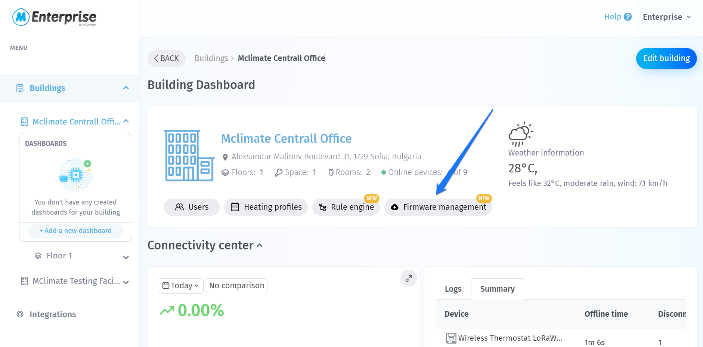
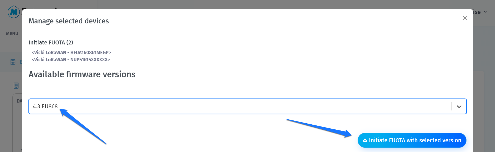
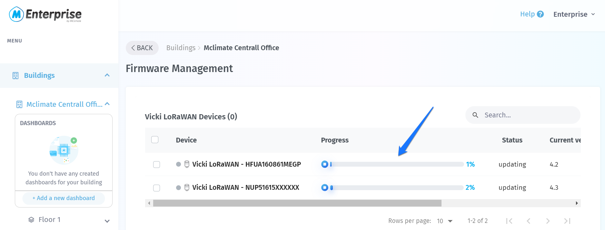

# Firmware Upgrade Over The Air (FUOTA)

Firmware Upgrade Over The Air (FUOTA) is a crucial process for the remote management of Internet of Things (IoT) devices. It enables the wireless update of firmwarе on devices that are part of an IoT network, making it possible for manufacturers and service providers to deploy firmware updates without needing physical access to the devices.


We've first released FUOTA in Q2 2022. We have since updated a large number of our devices to the latest available firmware.&#x20;

Some facts about FUOTA:

* It DOES NOT impact battery life of the device significantly (see metrics below)
* If a device's FUOTA session fails, the device will not freeze, but it will continue working as normally with the previous firmware image.


### FUOTA impact on device longevity

Updating our devices via FUOTA does not put a significant strain on their batteries. Statistically speaking the amount of power consumed throughout the Update procedure is negligible compared to its total lifecycle.

It is notable, however that this depends on the time it takes for the process to complete, which is directly related to the quality of the network coverage, that results in the utilization of higher or lower Spreading Factor (SF). To put things in perspective here are some numbers obtained via extensive testing and measurement:

**SF7 - 3 mAh**\
**SF8 - 4 mAh**\
**SF9 - 6 mAh**\
**SF10 - 9 mAh**\
**SF11 - 17 mAh**\
**SF12 - 35 mAh**

MClimate devices ship with 3500mA batteries of the highest quality that experience very minor voltage degradation over time. This allows them to utilize 2500mA of their total capacity before the core functionality of the device is compromised, which gives us the following numbers:


**SF7 - 833 updates**\
**SF8 - 625 updates**\
**SF9 - 416 updates**\
**SF10 - 277 updates**\
**SF11 - 147 updates**\
**SF12 - 71 updates**


These are incredible numbers especially if you have a good network coverage (this should be the case whether you plat to update or not as it impacts both longevity and total network capacity).

Any reasonably well designed product would not require 833 updates for a lifecycle of at least 10 years, thus FUOTA will have next to no impact on device longevity. On the other hand it is an amazing tool to prolong the functional lifecycle of a product and keep it up to date with technology advancements.

### FUOTA and LoRaWAN

In the context of LoRaWAN, which is a low-power wide-area network protocol designed for IoT devices, FUOTA is particularly valuable because many of these devices are deployed in locations that are difficult or costly to reach. FUOTA ensures that devices operating on any public or private LoRaWAN network can receive updates efficiently without compromising their battery life or duty-cycle, which is critical for long-term deployments.

#### Benefits for Smart Buildings

1. **Continuous Improvement:** Firmware enhancements can be rolled out to optimize device performance and add new features.
2. **Reduced Costs:** Automatic updates eliminate the need for manual servicing, reducing maintenance costs.
3. **Compliance:** Ensures devices remain compliant with evolving regulations and standards.

Overall, FUOTA is an essential component for maintaining and improving a network of IoT devices critical to the smart building ecosystem.&#x20;

## What's the difference between LoRaWAN FUOTA and NFC/Wi-Fi/Bluetooth/Serial FUOTA?

While LoRaWAN FUOTA allows over-the-air updates in LoRaWAN networks, technologies such as NFC (Near Field Communication), Bluetooth and Serial firmware upgrade requires close physical proximity. NFC and Bluetooth updates are initiated by bringing an NFC-enabled device close to the IoT device, making the process suitable for smaller-scale or individual updates.  Serial update means physically interfacing the device's circuit board with a connector and a programmer & laptop.&#x20;

However, LoRaWAN FUOTA provides a much more scalable solution for IoT deployments, allowing the update of countless devices across multiple sites without the need for physical interaction. This brings significant savings in terms of time and logistic costs, plus it minimizes downtime.&#x20;

### **Initiating a FUOTA session**


The MClimate Enterprise platform offers a built-in functionality that allows users to initiate the FUOTA procedure themselves.&#x20;

If you would rather not use Enterprise, you would need to email us at lorawan-support@mclimate.eu with a list of the  Serial numbers of devices you wish to update.

In both cases you still need to connect your LNS to our cloud (refer to the [Integrations](broken-reference) section).


Once you have your Integration properly configured so your LNS can communicate with our Cloud you need to go through the following steps:

* Create a Building where the devices will reside and import them
* Select Devices and Firmware version and initiate the process

#### Create a new building and import devices

We have already prepared a [Getting Started](https://app.gitbook.com/s/-McsOSt2XkjYl-QZLySV/getting-started) guide for your convenience that will guide you through the process of registration with the platform, creating your first building and importing your device.

Follow the steps and you should have your devices within a building in no time, ready to be updated.

#### Select devices and Firmware version and initiate the process.

Now that the devices are imported into a building you can choose which ones you want to update and which is the desired firmware version.

Head to the "Firmware management" section in the main view of your building.

<figure><figcaption>
Firmware Management
</figcaption></figure>

You will see a list of all devices in the building. Select the desired devices, you can select as many devices as you like, however for each device type you need to initiate the procedure separate.

<figure><figcaption>
Selecting devices
</figcaption></figure>

Let us initiate FUOTA for the two Vickis in the image above. Select them and press on the blue Firmware management button, a window will pop up with a drop-down menu where you can select the desired firmware version to be update to.

<figure><figcaption>
Firmware version selector
</figcaption></figure>

Once you press on the button to initiate the process you will be returned to the Firmware management screen with complete list of devices. You can follow the progress there in real time.

<figure><figcaption>
FUOTA progress
</figcaption></figure>


The process works in real-time however since you are still viewing it through a web-page you need to refresh it for the information to be updated. The progress bar will not refresh itself.


When the process finalizes successfully you will see the bar fill up to 100% and the process Status will change to "complete". At this point your devices are updated, taking advantage of any benefits the new firmware offers.


The FUOTA process does not disable normal operation of your devices, neither requires reset/reboot after. It is seamless and no user interaction is required with the exception of its initiation.



The above rule applies if your device is controlled either via Enterprise or via the MClimate API. If you are utilizing a proprietary solution to interact and control a device the FUOTA process will override any commands you send for the duration of the process and your service will not be available.


### What if my MClimate devices do not support FUOTA?

If you have a sizeable deployment, please get in touch with us at lorawan-support@mclimate.eu to discuss options for an on-site Serial update to the latest firmware, which will also add FUOTA for the future.
