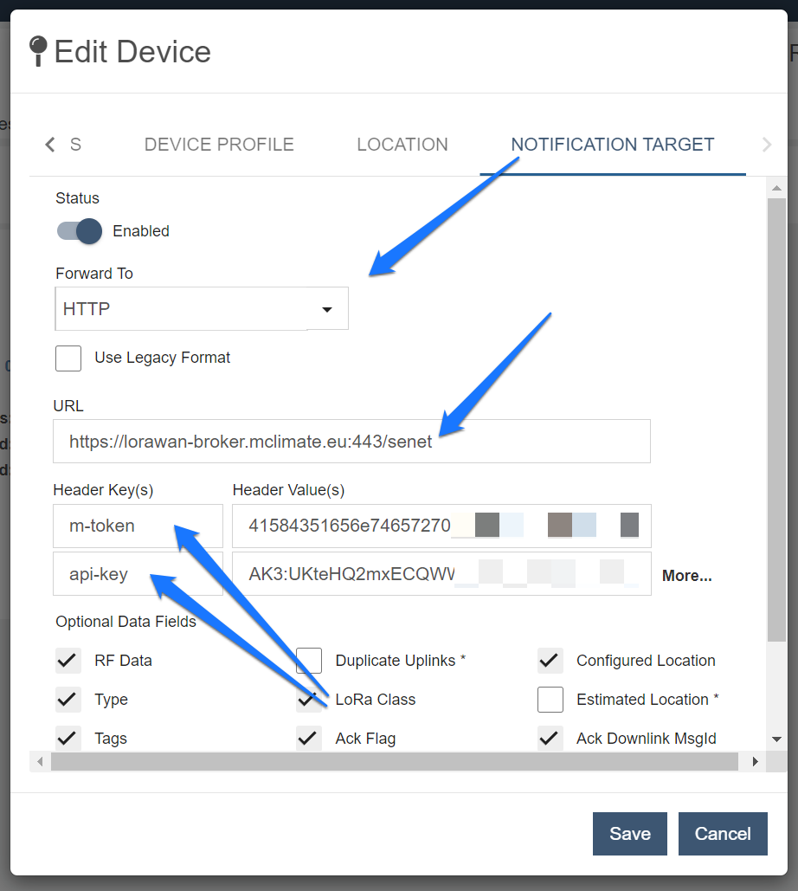
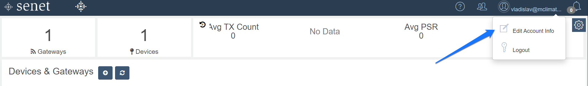
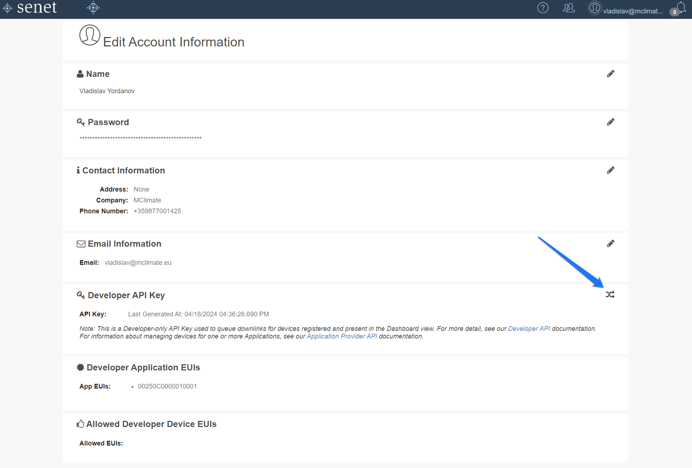

# Senet

## **Connection between Senet and MClimate’s LoRaWAN broker using Webhooks** 


The guide assumes you have your device registered with the Senet platform and you have access to the Dashboard.


### 1. Creating a notifier in Senet

Expand the device settings for your device in the Senet Dashboard

<figure><figcaption>
Device settings
</figcaption></figure>

Go to the NOTIFICATION TARGET section and select HTTP from the dropdown menu.

Enter the following URL in the text box: [https://lorawan-broker.mclimate.eu:443/senet](https://lorawan-broker.mclimate.eu/senet)

You will need to create two Header Keys (make sure you name them with these exact names):

* m-token
* api-key

<figure><figcaption>
Notification Target
</figcaption></figure>

Proceed to the next section of the guide to learn how to generate the Header Values. Leave the rest of the settings with their default values.

### 2. Create Enterprise M-token

Go to [https://enterprise.mclimate.eu/integrations](https://enterprise.mclimate.eu/integrations) and create your m-token.

<figure><figcaption>
Creating an m-token
</figcaption></figure>

Give it a name and copy it over into the m-token header value field in Senet

<figure><figcaption>
Copying the token
</figcaption></figure>

### 3. Create a Senet API-key

In the Senet Dashboard navigate to the Edit Account Info section.

<figure><figcaption>
Account section
</figcaption></figure>

Generate/Re-generate a new API Key and copy it over in the api-key header value field in Senet.

<figure><figcaption>
Generating the API-Key
</figcaption></figure>

Save the device settings in Senet, now that you have both the M-token and the API-Key and you are done.

Your device should now be visible in Enterprise.
