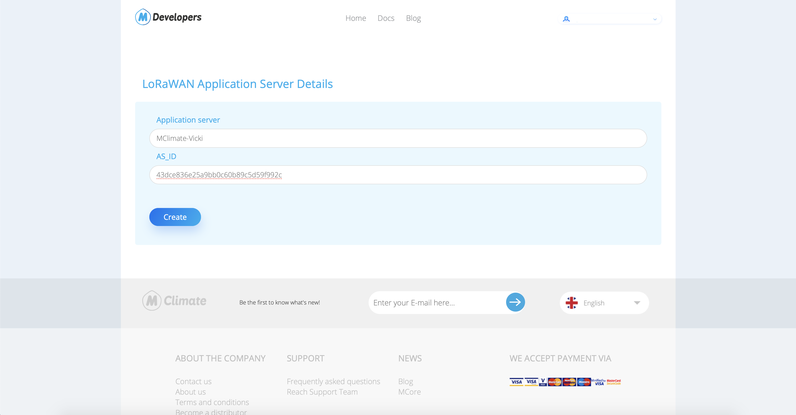
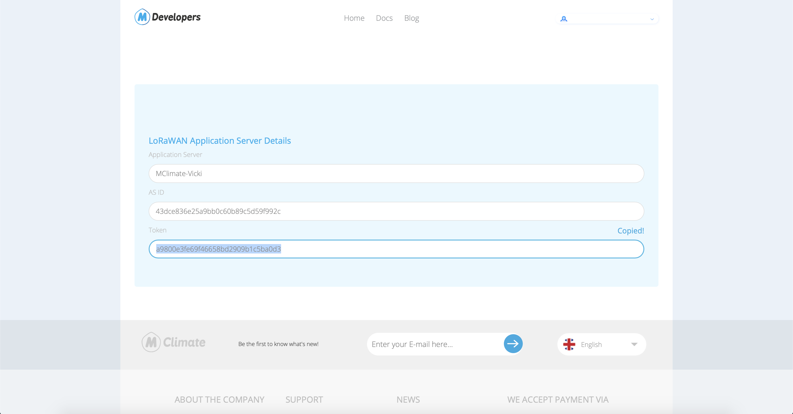

# Tektelic

## **Connecting Tektelic to MClimate’s LoRaWAN broker**

### **1. Create a new application server**

### **2. Create new Custom Data Converter**

Encode function is generated automatically.

Decode function please copy from here: [**Tektelic MClimate Decoder**](https://mclimate.bit.ai/docs/cZCxvaR76MTb87M5)

### **3. Go to Manage Integrations**

### **4. Create new HTTP Integration**

* Fill the fields&#x20;
  * Type - should be **HTTP**
  * Data Converter - use the one you created - **MClimate Vicki**
  * Application address -  [lorawan-broker.mclimate.eu](https://lorawan-broker.mclimate.eu/)
  * port - **80**
  * Base path - **/tektelic**
* Copy token in the HTTP URL path.

* **Create MClimate token**
  * **Go to** [**https://developers.mclimate.eu/lorawan-token**](https://developers.mclimate.eu/lorawan-token) **and Sign in with your MClimate account.**
  * **Enter the Application server, AS\_ID - with token from HTTP URL path, and click Create.**

* **Copy the token**

* **Create Headers**
  * **1st header**
    * **Key - should be "mclimate\_token".**
    * **Value - Paste the token from developers portal.**
  * **2nd header**
    * **Key - should be "m-token".**
    * **Value - Paste the token from** [**MClimate Enterprise -> Integrations**](https://enterprise.mclimate.eu/integrations)

### **5. Move device to Application**

### **6. Done**
