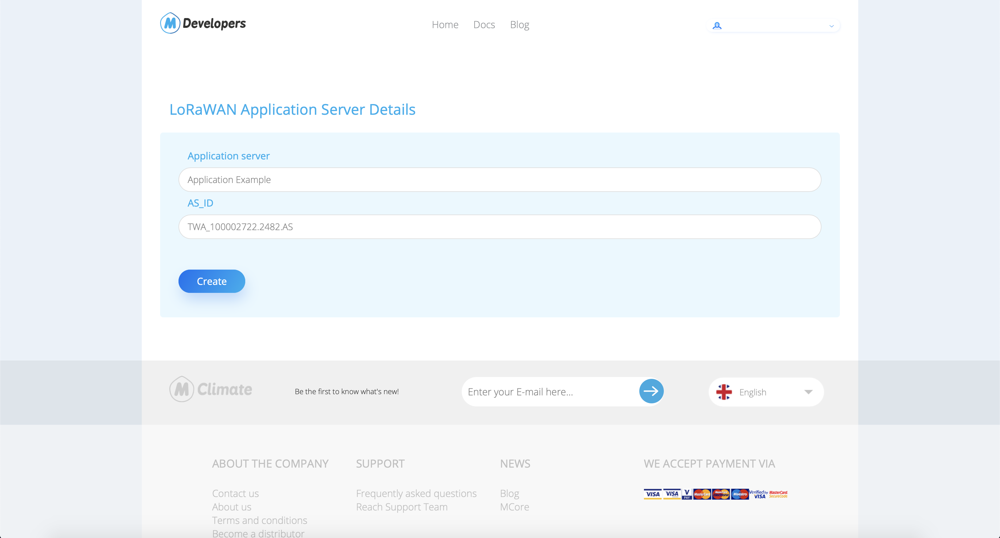

# ThingPark Community

## **Connecting ThingPark Community to MClimate's LoRaWAN broker**

### 1. Create a new application server in ThingPark Community

1. . In your Community Dashboard go to Applications -> Create -> Choose "https://"

2. &#x20;Fill in the desired application name, then add_**https://lorawan-broker.mclimate.eu/thingpark**_ as an URL. Choose JSON untyped for Content Type, leave the auto-generated Authentication Key.
3. Go to [https://enterprise.mclimate.eu/integrations](https://enterprise.mclimate.eu/integrations) and create your m-token.

<figure><figcaption></figcaption></figure>

Copy the token.

<figure><figcaption></figcaption></figure>

4. Create custom HTTP header with key with name “m-token” and for value paste the token from the enterprise.

<figure><figcaption></figcaption></figure>

5. click on "SAVE"
6. &#x20;A popup with button "VIEW THE APPLICATION" will appear and lead you to the already created application.&#x20;
7. &#x20;Copy the auto-generated Application ID.

8. &#x20;Go to [https://developers.mclimate.eu/](https://developers.mclimate.eu/lorawan-token) and sign in with your MClimate Account.&#x20;
9. &#x20;Go to [https://developers.mclimate.eu/lorawan-token](https://developers.mclimate.eu/lorawan-token) to generate a new Application Key.&#x20;
10. &#x20;Add the name of your Application, paste the copied Application ID in field AS\_ID and click on "Create".

11. Copy the key that was generated.

12. &#x20;Go back to the newly created Application and replace the auto-generated Tunnel Interface Authentication Key with the one that was generated in our Developers Portal by clicking on "Regenerate" and pasting the new key. Then click on the tick and your Application is ready to be used.

### 2. Connect a device to the application

Go to the panel of the device you want to connect to MClimate LoRaWAN Broker and change its application.

