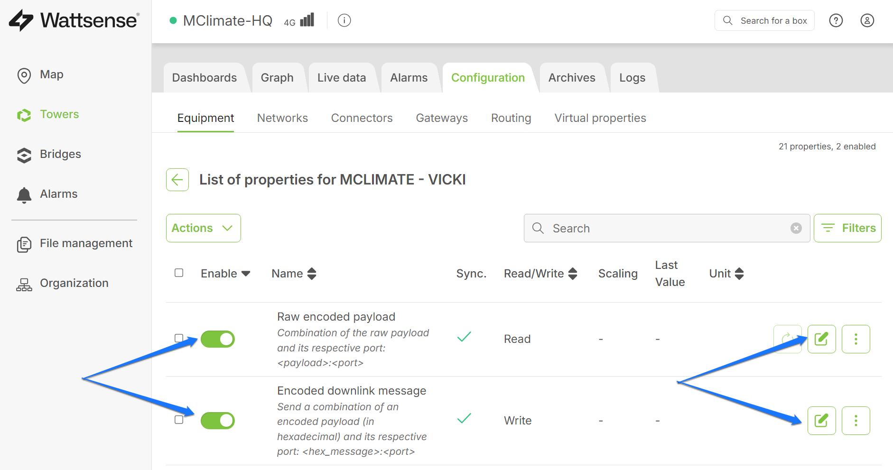
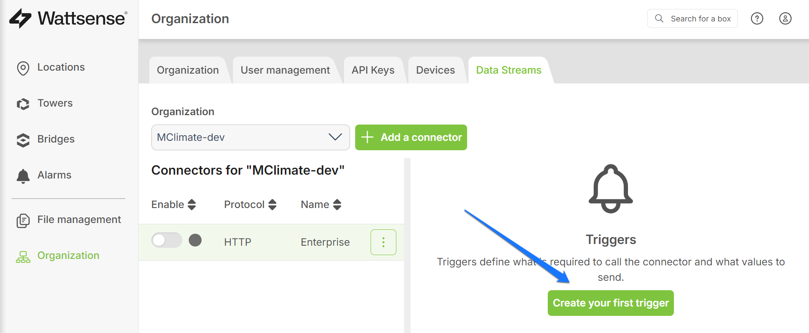

# Wattsense

## **Connection between Wattsense Tower and MClimate Enterprise** 

In order to properly create a Wattsense integration with MClimate Enterprise you need configure both the particular Wattsense Tower Device you are using and your Organization within the Wattsense platform.

## Configuring the Wattsense Tower

Log into our Wattsense Console ([https://console.wattsense.com/](https://console.wattsense.com/)) and open up the Tower you are going to be using to connect through. You need to edit some Properties of the devices that you wan to integrate (this needs to be done for every device you want to see in Enterprise)

<figure><figcaption>
Wattsense Tower configuration
</figcaption></figure>

There are 2 properties that need to be enabled at the very least as these are what Enterprise needs to extract the data that it is to display:

* Raw encoded payload
* Encoded downlink message

<figure><figcaption>
Required properties
</figcaption></figure>

You also need to Edit the "slug" for both properties in order to make them compatible with the Enterprise structure.

### Raw encoded payload

Open up the property editing window and expand the Advanced menu, where you need to fill in the following field

_Slug_ - **raw-encoded-payload**

<figure><figcaption>
Raw payload slug
</figcaption></figure>

### Encoded downlink message

Open up the property editing window (same as for the previous property) and expand the Advanced menu, where you need to fill in the following field

_Slug_ - **downlink-message**

<figure><figcaption>
Downlink slug
</figcaption></figure>

This completes the device level configuration.

## Configuring your Organization

Go to the Organization section and open up the API Keys tab.&#x20;

You need to create a "Service Account".

<figure><figcaption>
API Key tab
</figcaption></figure>

Give it a name and make sure to select "Site Manager" from the drop down menu for the permissions level.

<figure><figcaption>
Service Account
</figcaption></figure>

Now that you have a Service Account with sufficient permissions you can create the actual API Key. Refer to the image below.

<figure><figcaption>
API Keys
</figcaption></figure>

You can have multiple Keys, we will need a single one for this tutorial. Create one.

<figure><figcaption>
Adding an API Key
</figcaption></figure>

You need only enter a description and your set of Key and Secret will be generated (automatically downloaded in a file form).

<figure><figcaption>
API Key and Secret
</figcaption></figure>

Now that you have the Keys you need to import them into the Enterprise platform. Head over to the link [https://enterprise.mclimate.eu/](https://enterprise.mclimate.eu/) and log into your account. Go to the Integrations section and create a new M-token.

<figure><figcaption>
M-token
</figcaption></figure>

Make sure and copy it as you will need it together with the Keys to create the integration (it is the very last one in the list (image above). You can click on the box to open up a window where you need to enter the set of the 3 (M-token on top, Key in the middle and Secret at the bottom field):

<figure><figcaption>
Wattsense Integration
</figcaption></figure>

Your integration is now created. This will allow for the proper authentication between the Wattsense and MClimate Enterprise platforms.

In order to finalize the process you need to create a data stream. Go back to the Organizations section, but this time open  up the Data Stream tab and create a Connector.

<figure><figcaption>
Data Stream Connector
</figcaption></figure>

You need to fill all fields with the following values (use the image as reference if need be), only 3 of which are case specific (marked with the blue arrows)

* _Name_ - choose an appropriate one
* _Protocol_ - **HTTP (webhooks)**
* _Base URL_ - **lorawan-broker.mclimate.eu**
* _Event route_ - **/wattsense**
* _Alarms route_ - **/wattsense-alarms**
* _Values route_ - **/wattsense**
* _Secret key -_ **the value of YOUR M-TOKEN**
* _Authentication -_ **API Key**
* _Key name_ - **m-token**
* _Key value_ - **the value of YOUR M-TOKEN**
* _Key type -_ **Header**

<figure><figcaption>
Connector parameters
</figcaption></figure>

You also need a trigger, so go and create one.

<figure><figcaption>
Creating a Trigger
</figcaption></figure>

Give it a name and make sure to select the 3rd radio button (**Value** option), this will result in it being triggered when the two properties we made sure are enabled in the start of the tutorial send data. Finalize it by adding a Tower (you can list as many Wattsense Towers as you have here).

<figure><figcaption>
Trigger parameters
</figcaption></figure>

Finally make sure both the Connector and Trigger are enabled. The Trigger should by by default, but the Connector you need to turn on manually.

<figure><figcaption>
Trigger and Connector states
</figcaption></figure>

If you configured everything properly your Integration is now complete and you should be able to see data in MClimate Enterprise (provided you have registered the devices there already).
