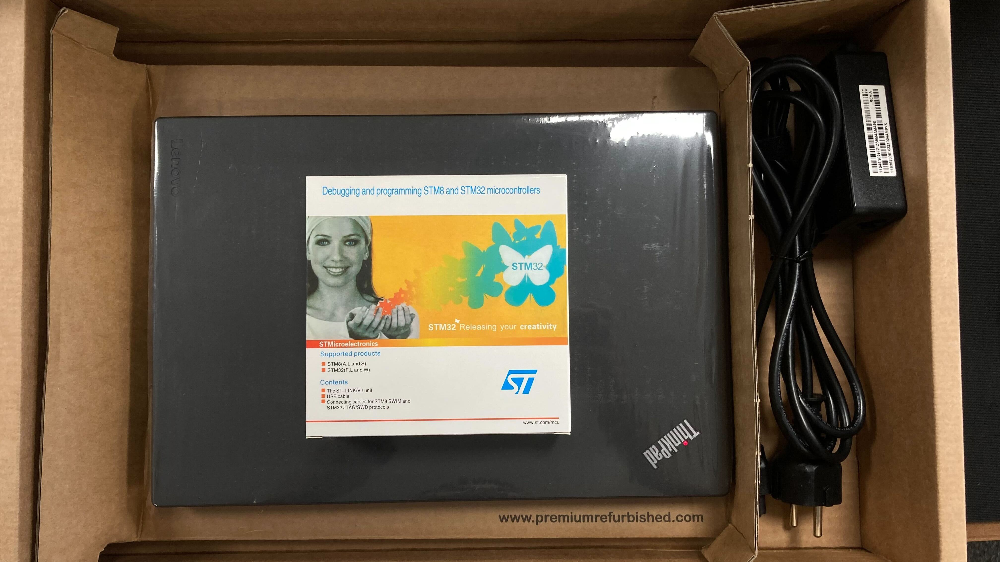
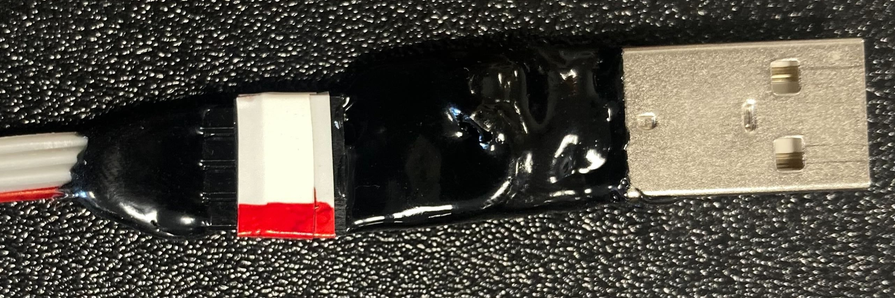

# Vicki Firmware Upgrade

The procedure is straightforward and will be described in text form. In addition, example videos will be included to better illustrate how to properly upgrade a Vicki via the **Field Programming Kit (FPK)**.

## What is in the package

You should have received the following devices with the FPK:

1.  A pre-configured laptop with the required software already installed and a box containing the tools.\

    <figure><figcaption>
FPK package 
</figcaption></figure>

    <figure><figcaption>
Box contents
</figcaption></figure>
2.  An FTDI to USB converter (small dongle with a cable attached).\

    <figure><figcaption>
FTDI converter
</figcaption></figure>
3.  STM32 programmer and custom board/cable attached (white device with the ST logo in blue).\
    Note that the orientation of the small breakout board needs to be as in the image (instructions are engraved on the components itself).\

    <figure><figcaption>
STM32 programmer
</figcaption></figure>
4.  A 3D printed adapter with connector receptacles that fits into the Vicki battery compartment (it is shaped like a battery set).\

    <figure><figcaption>
3D printed adapter
</figcaption></figure>

## Connecting the FPK to Vicki via the Laptop

### Connecting to the USB ports

Start by connecting the cables of both devices to 2 of the USB ports of the laptop. They are long enough to not prevent you from executing the rest of the procedure (the video reference uses an USB hub for convenience, your laptop will not need one).

### Connecting the Vicki

You will notice that the ST Device has a cable with 5 wires/pins and the FTDI converted has one with 4. These are matched by the receptacles on the 3D printed adapter, there is a set of 4 and a set of 5. We have put labels for your convenience on the 3D printed adapter.\
\
In addition they need to have the right orientation, each cable has one wire market in red. You need to plug in the cables in such a way that the colored wires are in the last receptacle, facing outwards (there also red markings on the body of the device, so match red with red).

Refer to the image below if in doubt.

<figure><figcaption>
Connecting the cables to the adapter
</figcaption></figure>

Once you are done you can take out the batteries from Vicki and insert the 3D printed adapter in their place. The adapter needs to be inserted a certain way for the upgrade to work properly. The pogo pins at the bottom end are what connects to the circuit board and the part needs to be inserted in such a way that they are in the battery compartment with the "+" marking.

Refer to the image below:

<figure><figcaption>
3D part orientation
</figcaption></figure>

Everything should be properly connected now and you should be able to start the Upgrade on the Laptop.


You need to press down on the 3D printed adapter with sufficient force to make sure it makes good contact with the circuit board. The upgrade will fail otherwise.


If still in doubt, watch the video below:


Connecting the field Kit to Vicki


## Starting the Firmware Upgrade

We have made a short screen recording for your convenience on how the procedure should go.

* Log into Windows and start the tool via the shortcut on the Desktop


The windows credentials are as follows:\
Username: MClimate\
Password: fieldkit


* An automatic message pops up which you should close with the "OK" button.
* Select the COM port from the drop down menu (there should be only a single COM to choose from, but incase you have another device connected it might happen there are additional ones). If you select the wrong port there will be an error as in the video below. Switch to another till you find the right one.


Wrong port selection


* Press on the "Program" button.
* Wait for the procedure to finalize, it should take less than 10 second, two command windows should pop up one after another. After, your result should light in Green.


It is possible the procedure fails (marked by a Result in RED). In this case disconnect and reconnect the device and Vicki and restart the Software tool, initiating the procedure anew.

We have put two videos below one for the successful case and one for the failed one for your reference


Successful Upgrade Video


Successful Upgrade


Failed Upgrade Video


Failed Upgrade

