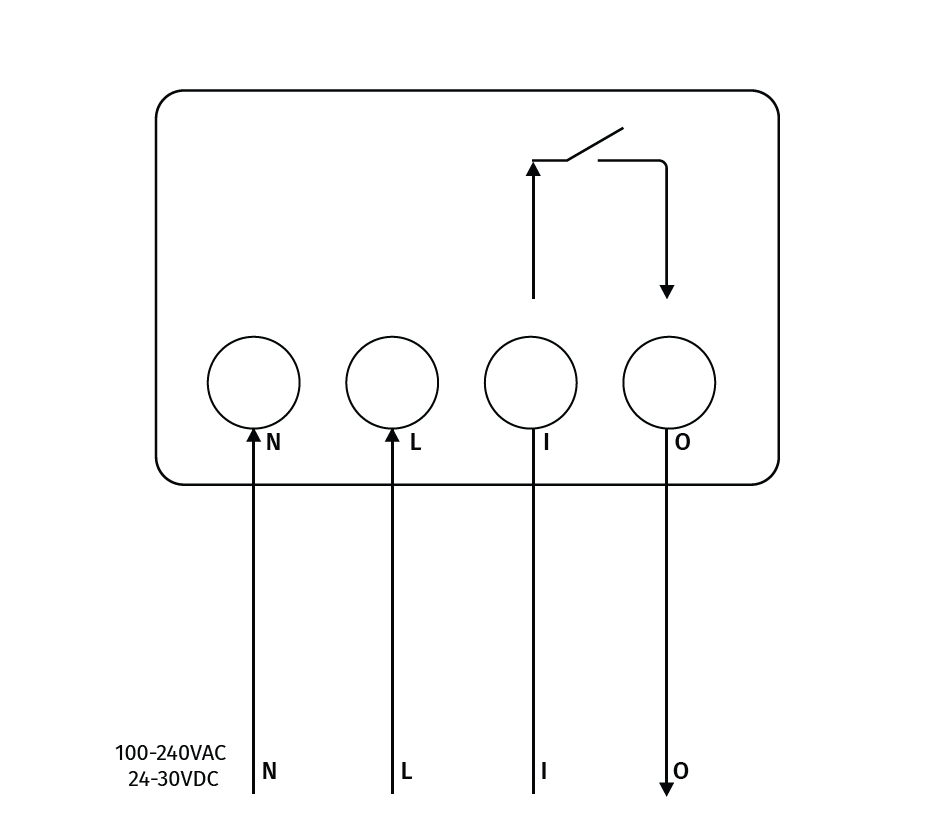

# MClimate End-to-end package: How to get started

## Prerequisites:

1. You’ve purchased an end-to-end solution from MClimate containing gateway(s), device(s) and Enterprise subscription.
2. You’ve received an email invitation to your building from [noreply@mclimate.eu](mailto:noreply@mclimate.eu)
3. You’ve received an email from fulfilment@mclimate.eu with information on how to get started.

## Gateway setup:

The gateway is fully configured by MClimate staff. It has an international SIM card inside and you should only need to power it and position it accordingly. Тhere is no need to connect it to a local network.

We have provided a short clip on how to properly assembly your gateway below, followed by instructions in text for as well.



1.  Take the Gateway out of the box and install the antennas. Make sure to install them in the proper way.\
    The LoRa antenna is marked by a number (in this example 868) and should be installed on the port that says "LoRa".\
    The cellular antenna has no marking should be installed on the port that says "4G"\
    \

    <figure><figcaption></figcaption></figure>
2.  Power on the gateway via the included USB cable and adapter.\

    <figure><figcaption></figcaption></figure>
3.  Monitor the LED on top of the device, it notifies you of the status (whether it has properly booted and connected, etc.).\
    \
    _Approximately 30 second after power-up, it should show the following:_\

    <figure><figcaption></figcaption></figure>
4. In case the gateway is not showing the lights as above, refer to the troubleshooting section below for more information. Don’t hesitate to reach out to [support@mclimate.eu](mailto:support@mclimate.eu) if you have any issues at this step.
5. **DO NOT REMOVE** the SIM card from the gateway.

### Gateway connection troubleshooting:

LED Status:

* Power LED  : This <mark style="color:red;">RED LED</mark> will be solid on if the device is properly powered.
* SYS LED  :
  * <mark style="color:blue;">SOLID BLUE</mark>: There is connection to the LoRaWAN Network Server (LNS)
  * <mark style="color:blue;">BLINKING BLUE</mark>:
    * Device has Internet connection but no connection to the LNS.
    * Device is in the booting stage where it will blink for a few seconds and become solid after (assuming there is internet connection and connection to the LNS).
  * <mark style="color:red;">SOLID RED</mark>: Device doesn't have Internet connection.

Refer to the [Gateway Positioning Guidelines](gateway-positioning-guidelines.md) for instructions on how to pick a good location.

## Devices Setup:

1. Your MClimate Devices are also pre-provisioned, they are registered with both the TTI LNS and the Enterprise platform. You only need to install/power them on to get started. Refer to the specific user manual of each device in order to properly install and power them.\
   [Link to do docs repo](https://docs.mclimate.eu/mclimate-lorawan-devices)
2. Once the devices have been powered, they should join the network (assuming they are within the coverage of a gateway) and start transmitting data. At this point you can observe them in Enterprise.
3.  Log into your Enterprise account with your credentials. You will have access to a newly created building/buildings with administrative privileges so you can modify it in any way you want.\

    <figure><figcaption>
Enterprise Building view
</figcaption></figure>
4.  All devices are already imported into the platform so you can start monitoring them. Scroll down to the Dashboard section and you should see a full list of the devices.\

    <figure><figcaption>
Enterprise Devices list
</figcaption></figure>
5. The devices will all be on the building level and it will be up to you to assign them to the locations you have installed them in.
6. Full user guide on how to use the MClimate Enterprise is available [here](https://docs.mclimate.eu/mclimate-enterprise).
7. This will get you started on your journey in the world of Smart, Sustainable building management with MClimate devices and the Enterprise platform. For more information on how to utilize the platform and its features to the fullest, refer to our documentation. We recommend reading the following articles next:
   * [Building structure - editing floors, spaces, rooms.](https://docs.mclimate.eu/mclimate-enterprise/configuration-and-management/building-management)
   * [Heating profiles](https://docs.mclimate.eu/mclimate-enterprise/configuration-and-management/buildings/heating-profiles)
   * [Boost mode](https://docs.mclimate.eu/mclimate-enterprise/advanced-features-and-use-cases/boost-mode)
